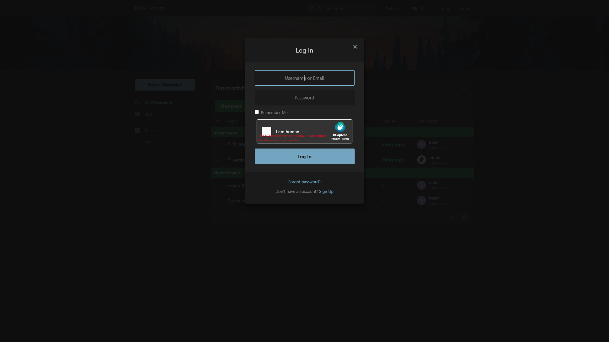
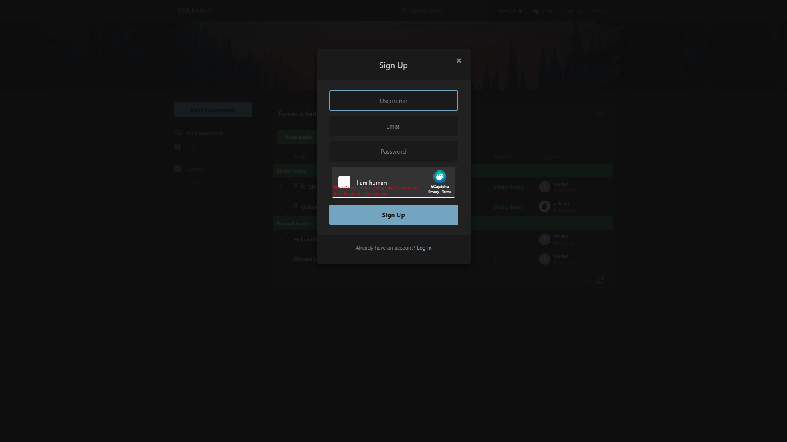
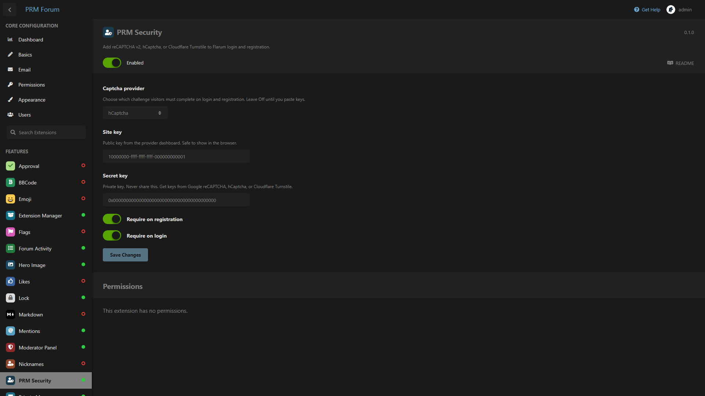

# PRM Security

CAPTCHA on Flarum **login** and **registration**. Pick one provider in the admin settings: Google reCAPTCHA v2, hCaptcha, or Cloudflare Turnstile.

Compatible with **Flarum 1.8**.

## Screenshots

Login:



Registration:



Admin:



## What it does

- One provider at a time, chosen from **Admin → PRM Security**
- Optional toggles: require on login, require on registration
- Widget on the login and sign-up modals
- Token is verified on the server; the secret key never goes to the browser
- Off by default until you choose a provider and paste keys

OAuth / registration-token sign-up is not challenged.

## Install

```bash
composer config repositories.prm-security vcs https://github.com/smmpanelscripts1/prm-security
composer require prm/security:dev-main
```

Enable **PRM Security**, then:

```bash
php flarum cache:clear
```

## How to use

1. Admin → Extensions → **PRM Security**
2. Choose a provider
3. Paste **site key** and **secret key**
4. Turn **Require on login** / **Require on registration** on or off
5. Save, then log out to see the widget

Production keys:

- [Google reCAPTCHA v2](https://www.google.com/recaptcha/admin) (checkbox, not v3)
- [hCaptcha](https://dashboard.hcaptcha.com)
- [Cloudflare Turnstile](https://dash.cloudflare.com)

For local `localhost` testing only, each vendor publishes dummy keys in their docs. Do not use those on a live forum.

## License

MIT
